# Airlift

**Your sleep and health metrics, airlifted to Apple Health every morning. Bridges Fitbit Air (and other Google-account Fitbit devices) data into Apple Health — on-device, open source, no server.**

The Fitbit Air is a screenless, sleep-focused tracker whose data lives in Google's
health ecosystem and does **not** export to Apple Health natively. Airlift is a small
iOS app that pulls last night's sleep session — plus heart rate, resting heart rate,
HRV, SpO₂, respiratory rate, steps and distance — from the **Google Health API** and
writes it all into HealthKit, with full sleep-stage detail (wake / light / deep / REM).

It runs entirely on your device. Your Google refresh token never leaves your phone —
there is no backend, unlike most of the commercial Fitbit↔Health sync apps.

> **Status:** early / v0.1. The Google Health API is pre-GA ("built in public"); its
> schemas and scopes may shift before its September 2026 GA. The wire models here are
> defensive but expect to verify them against a real payload (see [Limitations](#limitations--known-unknowns)).

---

## Screenshots

<p align="center">
  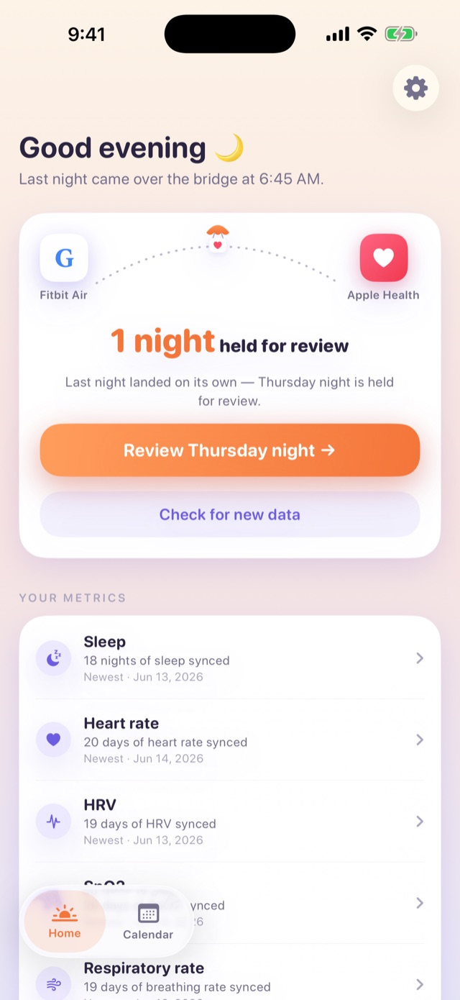
  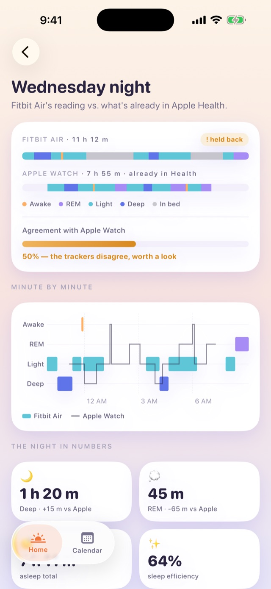
  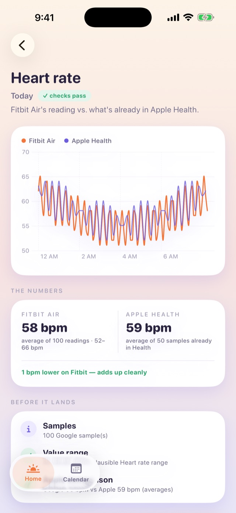
  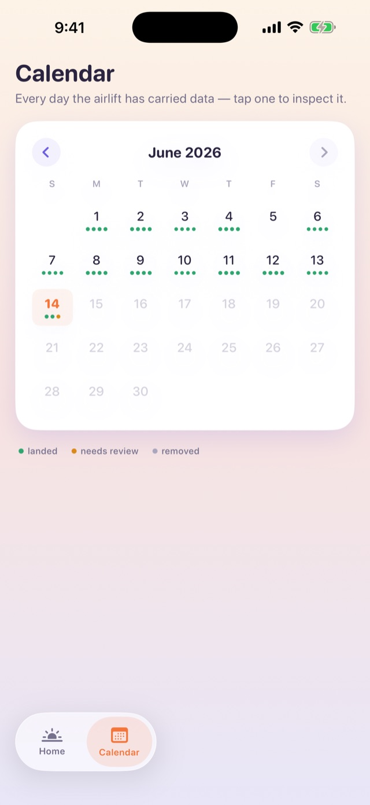
</p>

<p align="center"><em>Home &middot; sleep stages side by side &middot; metric comparison &middot; coverage calendar.</em></p>

---

## Features

- 🛌 **Full sleep stages** — wake → `.awake`, light → `.asleepCore`, deep → `.asleepDeep`,
  REM → `.asleepREM`, mapped faithfully to HealthKit, plus one `.inBed` sample spanning
  each session.
- 💓 **Seven health metrics** — heart rate, resting heart rate, HRV, SpO₂, respiratory
  rate, steps and distance.
- 🎛 **Sync only what you want** — every type, including sleep, has an on/off toggle in
  Settings → *What syncs*. Bridge just HRV and resting HR, skip steps to avoid
  double-counting against your iPhone — your call. Disabled types are clearly marked as
  "not syncing" on each day.
- 🔍 **Review-first by design** — every night and metric batch runs through sanity checks
  that compare it against what's *already in Apple Health* before anything is written.
  In **Automatic** mode, items that pass every check land on their own; anything flagged
  waits in a review queue. In **Review everything** mode, nothing is written without a tap.
- 🔁 **Idempotent** — a dedup store keyed on the Google dataPoint ID means re-running never
  creates duplicate Health samples. Imported sessions also record a content fingerprint, so
  when Google edits a session upstream, Airlift detects the change, re-stages it, and the
  write deletes-then-rewrites the night.
- 🔒 **On-device & private** — exactly three minimal read-only OAuth scopes, refresh token
  in the Keychain (this-device-only, never backed up), no server, no iCloud, no telemetry.
- ⚡ **Incremental & on demand** — fetching is user-initiated: opening the app never pulls on
  its own, it just shows when it last checked. **Fetch now** pulls only what's new since the
  last saved data (per metric), so a routine sync is small; a wide catch-up (first run or a
  long gap) warns it may take a couple of minutes. A daily `BGAppRefreshTask` (best-effort)
  is the only unattended path.
- 🌍 **Travel-correct** — sessions are resolved with their own UTC offset, not the phone's
  current time zone.

## Why this exists

Google has said native Google Health → Apple Health write-back is "coming later in 2026,"
but it isn't shipped, has no date, and aggregated sleep-stage fidelity has historically
been hit-or-miss. Airlift gives you faithful stages **now**, with full local control. Treat
it as a bridge until (and if) native sync makes it redundant.

---

## Requirements

- An iPhone (iOS 17+) and a Mac with **Xcode 16+**.
- A Fitbit Air or other Google-account Fitbit device.
- A Google account with Fitbit data, and your own **Google Cloud project** (free).
- [XcodeGen](https://github.com/yonaskolb/XcodeGen) (`brew install xcodegen`) — the Xcode
  project is generated, not committed.
- An Apple Developer account to install on a real device — a **free personal team** is
  enough, since HealthKit is the app's only entitlement. Note that apps signed with a free
  team **expire after 7 days**, so you re-build/re-install from Xcode about once a week; a
  paid ($99/yr) account removes that limit. (The Simulator can't run HealthKit writes against
  real data, but the app builds and the unit tests run there with no account at all.)

> **Why build it yourself?** Airlift can't ship on the public App Store yet — that needs one
> shared, Google-verified OAuth client (a restricted-scope security assessment) and the
> Google Health API to reach GA. Until then it's a build-it-yourself / sideload app, or
> TestFlight to a small allowlisted group. See [docs/app-store-checklist.md](docs/app-store-checklist.md).

## Setup

Roughly 15 minutes: create a free Google OAuth client, drop three values into a config
file, and build. No Apple paid account needed for the Simulator; a free Apple ID works for
your own device (re-sign weekly).

### 1. Create your Google OAuth client

Everything here is in the free [Google Cloud Console](https://console.cloud.google.com/).

1. **Create or pick a project**, then **enable the Google Health API**
   (APIs & Services → Library → search "Google Health").

   <p align="center">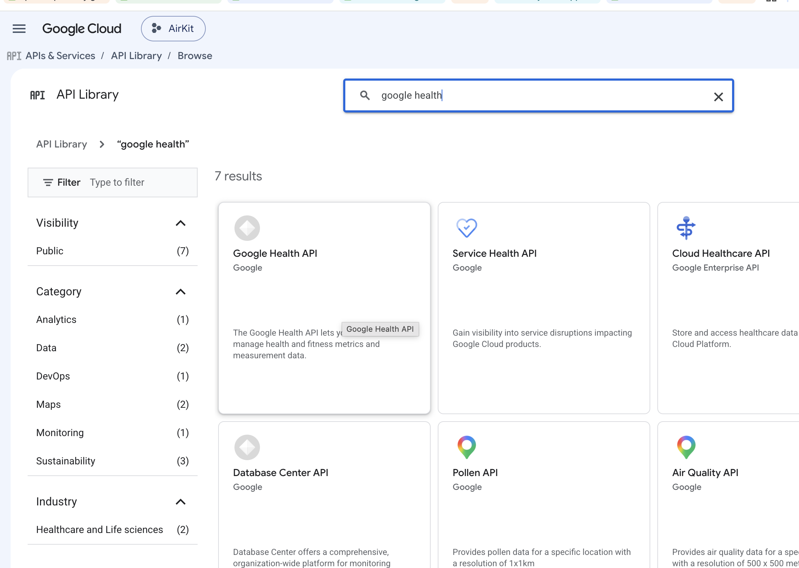</p>

2. **Configure the OAuth consent screen** as **External**, publishing status **Testing**.
   Under **Test users**, add the personal Google account your Fitbit data lives on. (Why
   Testing/External: see [OAuth & consent](#oauth--consent-read-this-before-you-start).)

   <p align="center">
     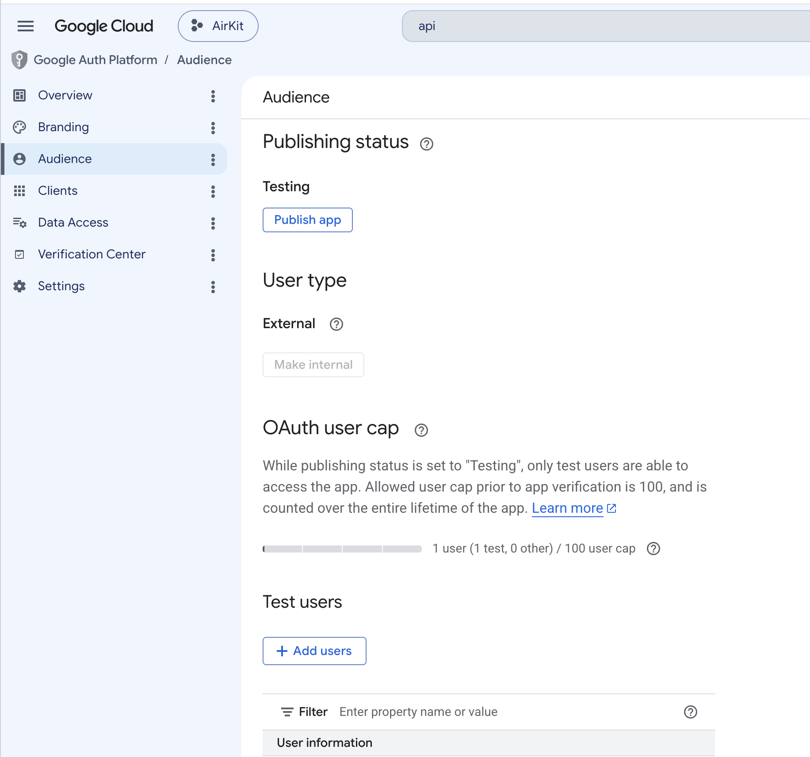
     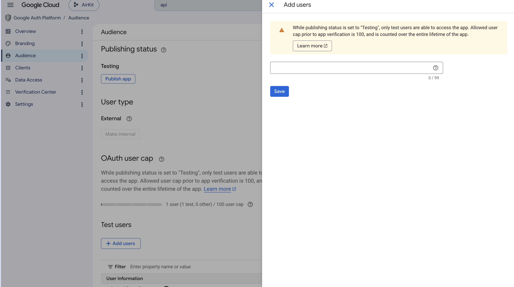
   </p>
   <p align="center"><em>Audience → User type <strong>External</strong>, Publishing status <strong>Testing</strong> &middot; add your account under <strong>Test users</strong>.</em></p>

3. **You don't pre-register scopes for personal use.** Airlift requests these three
   read-only scopes in its *own* sign-in request, and you grant them **on-device** in the
   Google consent dialog when you tap *Connect Google Health* — not in the console:

   ```
   https://www.googleapis.com/auth/googlehealth.sleep.readonly
   https://www.googleapis.com/auth/googlehealth.health_metrics_and_measurements.readonly
   https://www.googleapis.com/auth/googlehealth.activity_and_fitness.readonly
   ```

   They're read-only — Airlift never writes back to Google, so no `.writeonly` scope is ever
   requested. In **Testing** mode your project's **Data Access** page can stay **empty**
   ("No rows to display"); these pre-GA scopes don't even appear in the console's scope
   picker, and the grant happens in the on-device consent screen instead. Only if Google ever
   *blocks* the grant, or you move to **Production / verification**, add them by hand under
   Data Access → *Add or remove scopes* → *Manually add scopes*.

   > _📸 Screenshot to add: `docs/assets/setup/03-consent-grant.png` — the on-device Google
   > consent screen showing the read permissions being granted (this is where access is
   > actually given)._

4. **Create an iOS OAuth client ID** (Credentials → Create Credentials → OAuth client ID →
   iOS). The **bundle ID** you register must match the `AIRLIFT_BUNDLE_ID` you set in the
   next step — pick any reverse-DNS name, e.g. `com.yourname.airlift`. iOS clients are
   public clients (**no secret**); Airlift uses PKCE. Copy the **Client ID** and its
   reversed form.

   <p align="center">
     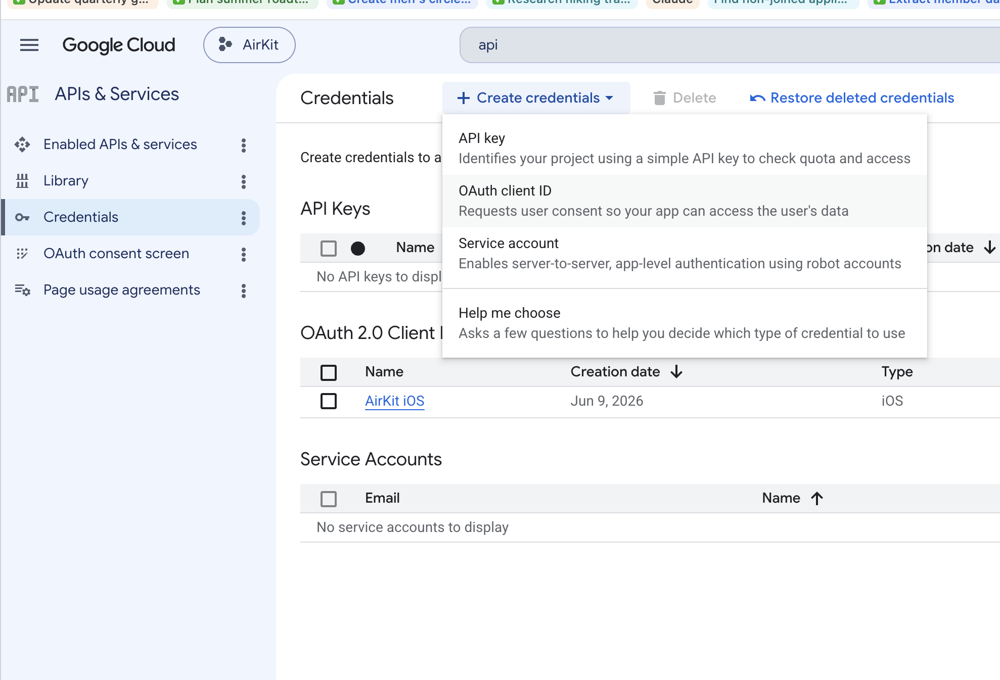
     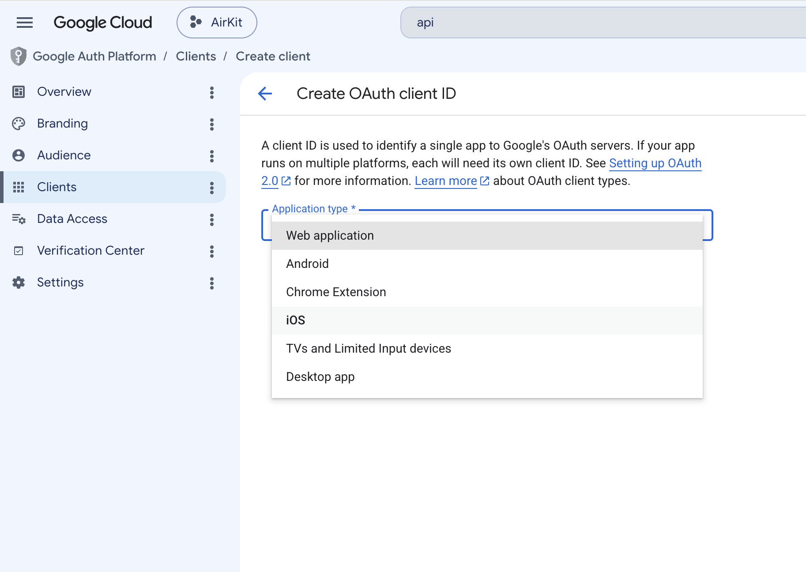
     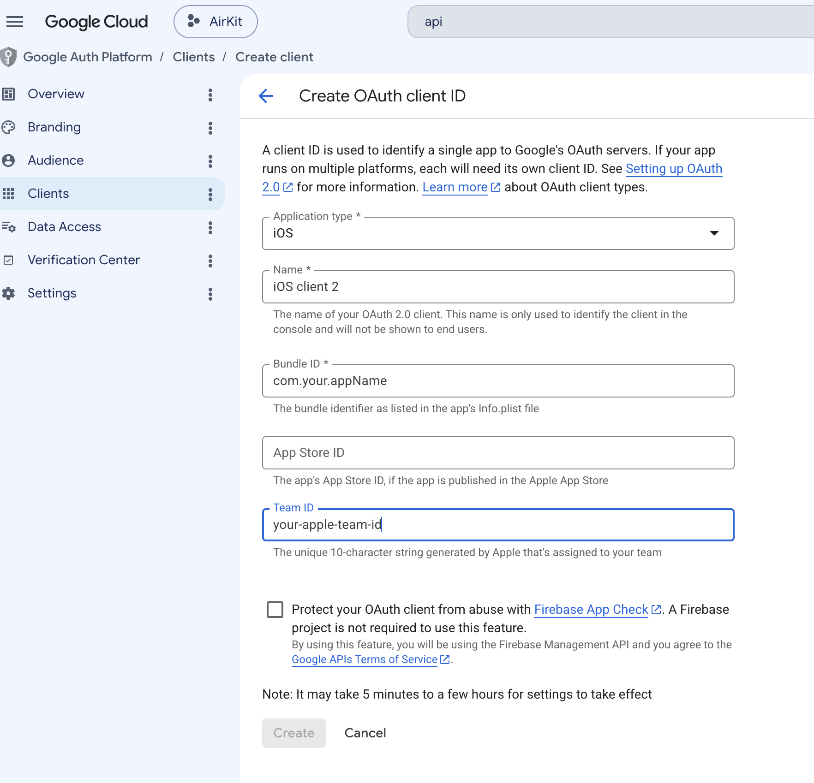
   </p>
   <p align="center"><em>Create credentials → OAuth client ID &middot; pick <strong>iOS</strong> &middot; set the bundle ID and your Apple Team ID.</em></p>

### 2. Configure the build

```bash
git clone <your-fork-url> Airlift
cd Airlift
cp Config.example.xcconfig Config.xcconfig
```

Edit `Config.xcconfig` and fill in:

| Key | Value |
|---|---|
| `AIRLIFT_BUNDLE_ID` | your bundle ID — **must match the Google OAuth client's** (defaults to `com.example.airlift`) |
| `GH_CLIENT_ID` | `1234567890-abc.apps.googleusercontent.com` |
| `GH_REVERSED_CLIENT_ID` | `com.googleusercontent.apps.1234567890-abc` |
| `DEVELOPMENT_TEAM` | your 10-char Apple Team ID (blank = Simulator only) |

`Config.xcconfig` is gitignored — your settings never get committed, and you never edit
tracked files like `project.yml` (it reads `$(AIRLIFT_BUNDLE_ID)`). The OAuth values
aren't secrets — public iOS clients have no secret — but each user brings their own client.

> _📸 Screenshot to add: `docs/assets/setup/05-config-xcconfig.png` — the four keys
> filled in (redact the real values)._

### 3. Generate & build

```bash
xcodegen generate
open Airlift.xcodeproj
```

In Xcode, open **Signing & Capabilities**, pick your Team, and confirm the bundle ID
matches the one you registered with Google. Then select your iPhone and build & run.

> _📸 Screenshot to add: `docs/assets/setup/06-signing.png` — Signing & Capabilities
> with your Team selected — and `docs/assets/setup/07-run.png` — the scheme/destination
> bar with your iPhone selected._

> 💡 The Xcode screenshots above (and the on-device **consent** screen earlier) still need to
> be captured — they're of your own machine. See [docs/assets/setup/](docs/assets/setup/) for
> a checklist with the exact filenames.

### 4. First launch

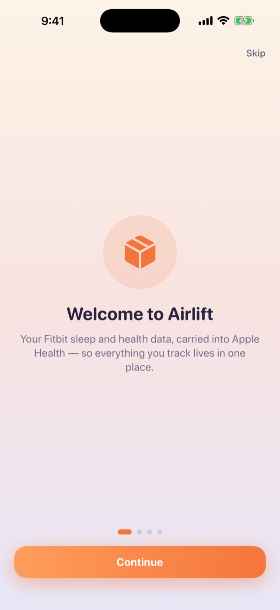

1. The onboarding walkthrough explains what Airlift does — tap through to **Get started**.
2. Tap **Connect Google Health** and complete the Google sign-in. (In Testing mode you'll
   see an "unverified app" screen — that's expected; continue.)
3. Grant the **HealthKit** prompt.
4. Tap **Fetch now**. The first sync pulls about a week of data and can take a minute or two.
5. Open **Apple Health → Browse → Sleep** to confirm the night landed.

That's it — from then on, **Fetch now** only pulls what's new.

<br clear="right" />

---

## OAuth & consent (read this before you start)

Airlift uses a **bring-your-own-client** model: there is **no shared OAuth client** baked into
the app. Each user registers their own OAuth client in their own Google Cloud project and
drops the client ID into `Config.xcconfig`. This is deliberate — it keeps the repo
credential-free, avoids anyone depending on a single client the maintainer has to keep alive,
and (most importantly) sidesteps Google's **Restricted-scope verification**, which the
`googlehealth.*` health scopes would otherwise require. (Verification is a heavyweight,
often paid security assessment aimed at published hosted apps — not a fit for a sideloaded
personal utility.)

**Use External + Testing, with a personal Google account:**

- The account you authorize with must be the one your **Fitbit data lives on**. As of 2026,
  Google does **not** allow Google Workspace accounts to access health/Fitbit data, so this is
  effectively always a **personal `@gmail.com` account** — even if you have a Workspace org.
- That rules out the *Internal* consent type (Internal is org-only and can't touch personal
  health data anyway). So: consent screen = **External**, publishing status = **Testing**, and
  add your own Google account under **Test users**.
- In Testing mode the **refresh token expires every ~7 days**, so you'll re-tap **Connect**
  about once a week. Airlift detects the expired/revoked state, shows a "Reconnect needed"
  status, and posts a local notification — background syncs can't stop silently. (Notification
  permission is requested right after your first successful Connect.)

> ⚠️ Confirm two things first (M0): that the **Google Health API is actually enabled and
> accessible** to your project (it's pre-GA and may be allowlisted), and that your **personal
> account in Testing mode** can consent to these specific health scopes. Google sometimes gates
> health scopes harder than other Restricted ones.

> 💡 **Want a one-tap experience for the whole community instead of BYO?** That would mean
> publishing *one* verified client (Model A) — Google Restricted-scope verification, a privacy
> policy, a verified domain, and ongoing responsibility for all users' data. Out of scope for
> v0.x, but noted as a possible future if the project takes off.

---

## Privacy

What leaves your device: **nothing**, except the OAuth handshake and read-only API calls
to Google. There is no server, no analytics, no telemetry, no iCloud — the iCloud
entitlement doesn't exist in this app.

- **Tokens** — the Google refresh token lives in the iOS Keychain with
  `kSecAttrAccessibleAfterFirstUnlockThisDeviceOnly`: it never leaves the device and is
  excluded from backups and device transfers.
- **Scopes** — exactly three read-only scopes (sleep, health metrics & measurements,
  activity & fitness). No location, nutrition, profile or write access, ever.
- **Debug dumps (opt-in, DEBUG builds only)** — launching a DEBUG build with the
  `-AirliftDumps 1` launch argument writes raw API pages and staged data to the app's
  **local** `Documents/Dumps` folder, for diagnosing wire-schema issues. It's off by
  default, never leaves the device, and is visible in the Files app only because the app
  enables file sharing (`UIFileSharingEnabled`) so you can inspect or delete the dumps
  yourself.

## Architecture

```
iOS app (SwiftUI, on-device only)
 ├─ Auth/          PKCE + ASWebAuthenticationSession OAuth, Keychain token store
 ├─ GoogleHealth/  API client, defensive Codable models, retry/backoff
 ├─ Metrics/       the seven quantity metrics — kinds, wire models, HealthKit units
 ├─ Health/        stage mapper (pure) + HealthKit writer (per-stage + .inBed)
 ├─ Sync/          dedup + fingerprint stores, sync-window logic, SyncEngine, sync log
 ├─ Background/    BGAppRefreshTask scheduler (one best-effort refresh per day)
 ├─ Views/         SwiftUI screens — home, review, calendar, history, settings
 ├─ Debugging/     opt-in debug dumps, DEBUG-only UI mock fixtures
 └─ Support/       logging, reconnect notifications
```

Sync cycle: ensure a valid access token → fetch sleep + each enabled metric, each from just
after the newest day already saved (a small overlap catches late/edited data; the first run
of a kind looks back a week) → skip IDs already in the dedup store, and re-stage sessions
whose content fingerprint changed upstream → run sanity checks against what's already in
Apple Health → stage everything for review. In **Automatic** mode the engine then imports
items that passed every check on its own; flagged items (and, in **Review everything** mode,
*all* items) wait for your tap. The per-kind window is derived from the sync ledger and is
never advanced past a failed fetch or an unresolved held item. The engine guards re-entrancy,
retries 408/429/5xx with exponential backoff, and re-runs are idempotent.

## Living with other sources (Apple Watch, iPhone, other apps)

Once Airlift writes to Apple Health it becomes one *data source* among several — your
iPhone counts steps, an Apple Watch may record sleep and heart rate, other apps may
contribute too. How Health resolves the overlap is subtle, and the in-app tutorial
(Settings → "Learn how to set source priority") walks through it. The short version:

- **Priority reordering exists only for metrics Health adds up** — Steps, Distance,
  Active Energy and similar. For those, Health counts the *top-priority* source wherever
  data overlaps. Go to the data type → **Data Sources & Access** → **Edit**, then drag
  the ≡ handles. The list looks view-only until you tap Edit, and handles only appear
  next to sources that have actually written that data type.
- **Sleep, heart rate, SpO₂ and other sampled metrics have no priority at all** — every
  source's readings coexist. In Edit mode you only get **checkmarks**: unchecking a
  source hides its data for that metric entirely. To surgically remove Airlift-written
  days instead, use Airlift's Calendar → day → metric → "Remove from Apple Health".
- **Old devices linger.** Every Watch (or app) that ever wrote data stays listed as a
  source forever — including unpaired watches and, if you renamed/reinstalled this app,
  its previous identity. Harmless, but expect a long list. Removing one requires
  deleting all of its Health data (tap the source → Delete All Data).
- Default priority, where it applies: manual entries first, then iPhone/Apple Watch,
  then third-party apps like Airlift — so Apple Watch owners who prefer the band's
  steps must reorder (or disable Steps/Distance sync in Airlift entirely).

## Limitations & known unknowns

- **Wire schema is provisional.** The Google Health wire models are a best-effort shape
  for the pre-GA API. Capture a real `dataPoints` response and adjust the `CodingKeys`
  / field names — they are deliberately isolated to `Sources/GoogleHealth`.
- **Edited sessions that change ID.** If Google edits a session but *keeps* its dataPoint
  ID, Airlift detects the change and rewrites the night. If Google instead reissues the
  session under a **new** ID, it imports as a new night alongside the old one — a known
  limitation you'd resolve manually in Apple Health.
- **Background timing is best-effort.** iOS may not fire `BGAppRefreshTask` daily, and the app
  doesn't fetch on launch — **Fetch now** is the reliable way to pull the latest.
- **Google may make this obsolete.** Native Google Health → Apple Health write-back is
  promised for "later in 2026." If it ships and gives you faithful stages, you may not need this.

## Contributing

PRs welcome — see [CONTRIBUTING.md](CONTRIBUTING.md). The pure logic (stage mapping, sync
window, PKCE, civil-time parsing, backoff) is unit-tested; please keep it that way.

Changes are tracked in [CHANGELOG.md](CHANGELOG.md). Bug reports and feature requests go
through the [issue templates](.github/ISSUE_TEMPLATE); security issues are reported
privately — see [SECURITY.md](SECURITY.md).

## Support

Airlift is free, open source, and runs entirely on your device — no server, no
subscription, unlike the commercial Fitbit↔Health sync apps. If it saved you from paying
for one, you can buy me a coffee:

[](https://www.buymeacoffee.com/santekotturi)

## License

[MIT](LICENSE) © 2026 Sante Kotturi
